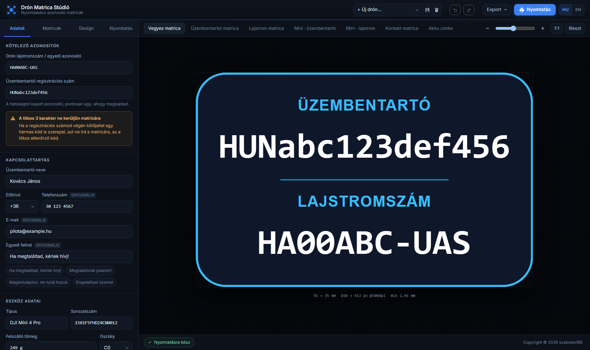
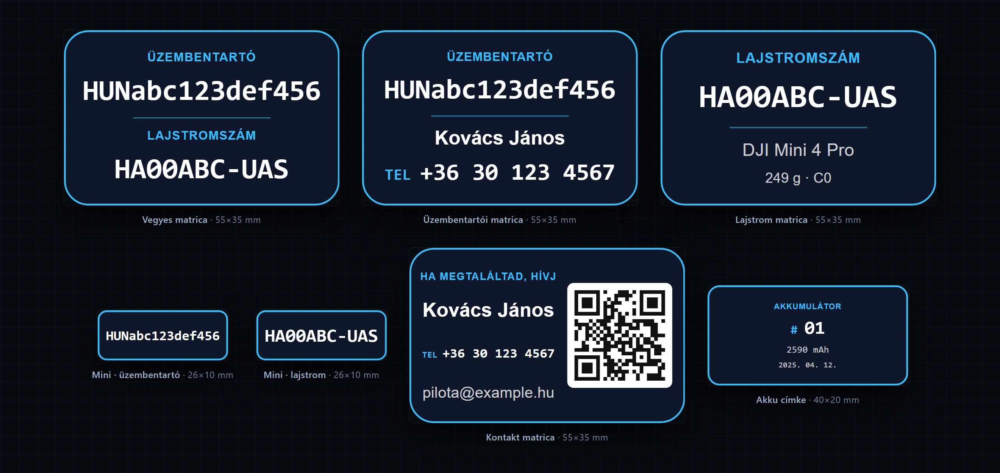

# Drón Matrica Stúdió

Nyomdakész drón azonosító matricák a böngésződben: üzembentartói regisztrációs szám, lajstromszám, kontakt- és akkumulátor-címkék, QR kóddal, mm-pontos nyomtatással. Nincs backend, nincs feltöltés: minden adat a gépeden marad.

**[▶ Élő demó](https://szabolevi98.github.io/dron-matrica/)**



## Matrica típusok



| Típus | Alapméret | Mire jó |
| --- | --- | --- |
| Vegyes matrica | 55 × 35 mm | Mindkét kötelező azonosító egyetlen matricán |
| Üzembentartói matrica | 55 × 35 mm | A kötelező `HUN…` regisztrációs jelölés |
| Lajstrom matrica | 55 × 35 mm | Lajstromszám, típus, tömeg és osztály |
| Mini · üzembentartó | 26 × 10 mm | Csak a `HUN…` szám akkura, kontrollerre, táskára |
| Mini · lajstrom | 26 × 10 mm | Csak a lajstromszám, ugyanabban a méretben |
| Kontakt matrica | 55 × 35 mm | Név, telefon, e-mail + QR a megtalálónak |
| Akku címke | 40 × 20 mm | Sorszám, kapacitás, üzembe helyezés dátuma |

A jogszabály csak a két azonosítót írja elő: az üzembentartói számot és a drón lajstromszámát. A név, telefonszám, e-mail és weboldal mind opcionális. Ezért az első két típus önmagában is elég, a többi extra.

Minden típus mérete, alakja, tartalma és sorrendje külön állítható, és egyszerre több típus is nyomtatható egy ívre.

## Funkciók

- **Valós mm-es kimenet**: a matricák SVG-ben, milliméter koordinátákkal készülnek, így a nyomtatás méretre pontos
- **Builder panel**: minden tartalmi elem külön ki/be kapcsolható és sorrendezhető
- **Automatikus tipográfia**: a szöveg soha nem lóg ki, a betűméret magától igazodik a matricához
- **Kontraszt-ellenőrző**: WCAG-alapú mérés, figyelmeztet, ha a jelölés nehezen olvashatóvá válik
- **Titkos kód figyelmeztetés**: pirossal jelzi, ha a regisztrációs szám kötőjeles, titkos ellenőrző kódja rákerülne a matricára
- **QR kód**: hívható telefonszám, vCard névjegy, link, azonosítók vagy egyedi szöveg
- **Logó és háttérkép**: saját kép beágyazható, opacitás-szabályozással
- **Nyomtatási kosár**: több különböző matrica egy A4-es ívre, vágójelekkel és térközzel
- **Export**: PNG (300 / 600 / 1200 DPI), vektoros SVG, PDF
- **Drónjaim**: több eszköz beállítása menthető, JSON-ba exportálható és megosztható linkkel
- **Magyar és angol** felület, kétnyelvű feliratok a matricán is
- **Undo / redo**, billentyűparancsok (`Ctrl+Z`, `Ctrl+Y`, `Ctrl+P`, `Ctrl+S`)
- **Adatvédelem**: teljesen kliensoldali, semmi nem megy szerverre

## Nyomtatás

1. A **Nyomtatás** fülön állítsd be a papírt, a margót és a térközt
2. Add a kosárhoz a matricákat, vagy töltsd fel az ívet az aktív típussal
3. Nyomd meg a **Nyomtatás** gombot
4. A böngésző párbeszédében a méretezés legyen **100%**, ne „oldalhoz igazítva”, és engedélyezd a háttérgrafikák nyomtatását

Fehér, matt öntapadós A4 matricapapír adja a legjobb eredményt. Kültéri használatra érdemes laminálni vagy vízálló fóliára nyomtatni.

## Fejlesztés

Nincs build lépés és nincs csomagkezelő, csak statikus fájlok ES modulokkal. Bármilyen statikus szerver alól fut:

```bash
python -m http.server 8000
```

```
index.html
css/style.css
js/
  main.js       állapot, UI vezérlés, események
  render.js     SVG matrica renderer, automatikus szövegilleszés
  layouts.js    matrica típusok, elemek, témák, méretek
  export.js     PNG / SVG / PDF export, nyomtatási ív kirakása
  qr.js         QR tartalom és mátrix
  validate.js   azonosító-ellenőrzés, kontraszt számítás
  store.js      localStorage profilok, megosztható link
  i18n.js       magyar és angol szótár
vendor/         helyben tárolt függőségek és betűtípus
assets/         favicon és képek
```

Nincs külső hálózati hívás: a Bootstrap, a `qrcode-generator`, a `jsPDF` és az Inter betűtípus mind a `vendor/` mappában van, a repóból töltődik be. Az oldal internet nélkül is teljes értékűen működik.

## Megjegyzés

Az eszköz a jelölés elkészítésében segít, de nem jogi tanácsadás. Az üzembentartói regisztrációért és a hatályos jelölési előírások betartásáért az üzembentartó felel. A saját azonosítódat mindig a hatóságtól kapott adatok alapján add meg.

## In English

A client-side studio for print-ready drone identification labels: EU/EASA operator registration number, aircraft registration, contact and battery labels, QR codes, and millimetre-accurate printing. Labels are rendered as SVG with real mm coordinates, so printed output matches the specified size exactly. Includes auto-fitting typography, a WCAG contrast checker, multi-label A4 sheet layout with cut marks, PNG/SVG/PDF export, saved device profiles, and a Hungarian/English interface. No backend, nothing leaves the browser.

## Licenc

MIT licenc. Copyright © 2026 [szabolevi98](https://levente.net/)
